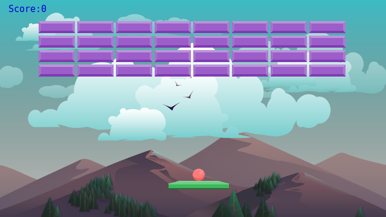

# Игра Арканоид

Это небольшая, простая игра на ванильном JavaScript с использованием HTML5 canvas.  
По большей части, вы здесь не увидите мою личную изначальную разработку, поскольку этот небольшой проект всего лишь видеокурс **"Разработка HTML5 арканоида на JavaScript и Canvas"**. Это видеокурс от **Udemy**. Я решил пройти его не просто чтобы бездумно повторять действия за преподавателем, а для того чтобы разобраться как работает JavaScript и углубиться в JavaScript. **Моя цель - глубоко проанализировать что делает преподаватель, разобраться в деталях, а затем постараться по возможности оптимизировать скрипт**.  

## Как обстоят дела

Все видеоуроки по разработке игры арканоид пройдены. Получилась в целом неплохая демка, конечно есть много шероховатостей. Как по мне, не хватает еще многого - это и генерации уровней, и таблицы рекордов. Так что, кто хочет доработать код, модифицировать игру, сделать её полноценной - добро пожаловать!  
На данный момент игра вполне рабочая, если вы сидите со стационарного компьютера или ноутбука, то можно [поиграть](http://arkanoid.technoninja-xp.h1n.ru/)  
**Управления достаточно простое:** Пробел - запускает мячик в блоки, а стрелки влево и вправо - двигаю платформу. Смысл игры думаю всем понятен - пытаемся мячиком разбить все блоки и не даём мячику упасть вниз.

### Как установить проект

1. Установить Node.js
2. Клонировать репозиторий, выполнив в терминале: `git clone https://github.com/Evgeny-TechnoNinja/lightArkanoidGame.git`
3. Открыть через терминал корневой каталог проекта. Прописать:
4. `npm install`
5. `gulp watch`
6. Работать смело с проектом. Вносить свои улучшения.

## Пожелания

У меня есть пожелание самому себе - это досконально разобраться в тонкостях JavaScrip и углубиться в этот замечательный язык программирования. Также у меня сегодня есть надежда, что эта игра-арканоид будет завершенной и иметь полноценный вид.
